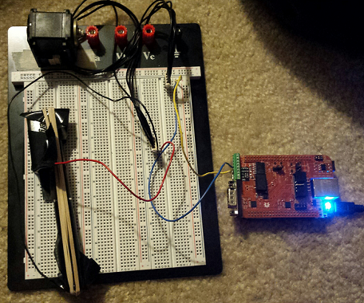
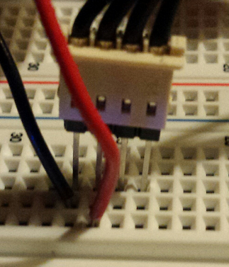
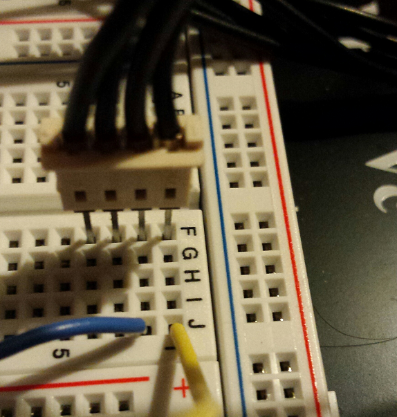
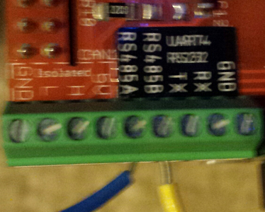

# bbb-dynamixel
Python modules for controlling a dynamixel motor using a Beaglebone Black

## Purpose
Illustrate how to use serial communication in python running on a Beaglebone Black to control a dynamixel servo.
This may be preferred by some over setting up the Dynamixel SDK and using the C language it supports.

## Hardware
- Beaglebone Black with serial cape
- Dynamixel servo (tested with rx-24f but any r-series should work)

### Schematic

Plan view:

Supply wiring:

Dynamixel serial connector wiring:

Beaglebone Black serial cape wiring:

## Test

`python -c "import test; test.test()"`
